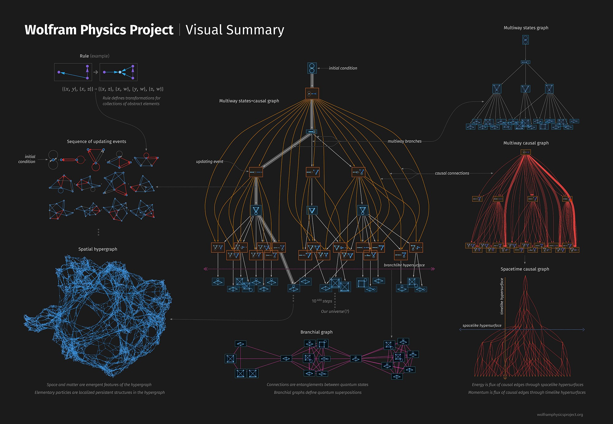

<!--  -->

# **ramblings of a mad man in the [hypergraph](https://medium.com/syncedreview/stephen-wolfram-the-path-to-a-fundamental-theory-of-physics-may-begin-with-a-hypergraph-c1fd124b6e62)**
## Ramblings

[[2021-10-31]]

## Poetry

## Ideas I've Spent Time On

> built with <https://github.com/foambubble/foam>
> deployed with <https://pages.github.com>
> hosted with <https://netlify.com>
> domain from <https://domains.google>

[//begin]: # "Autogenerated link references for markdown compatibility"
[2021-10-31]: journal/2021-10-31 "Friday, October 31, 2021"
[//end]: # "Autogenerated link references"